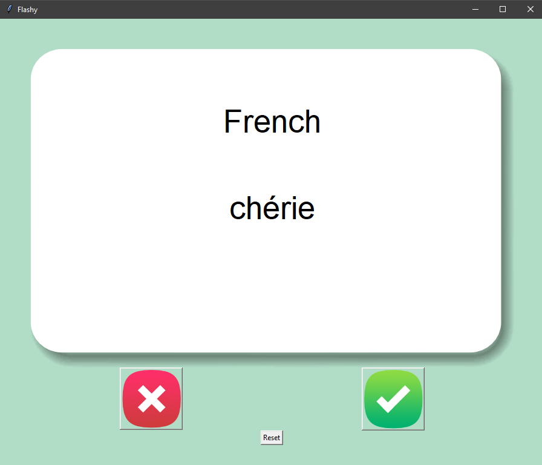
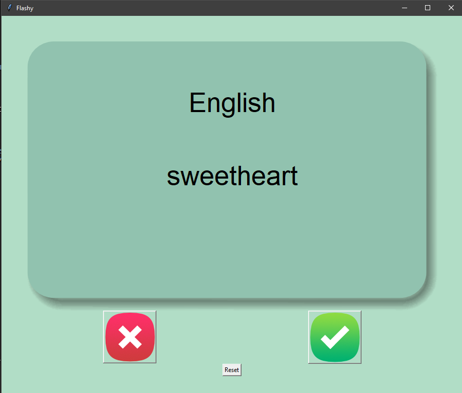
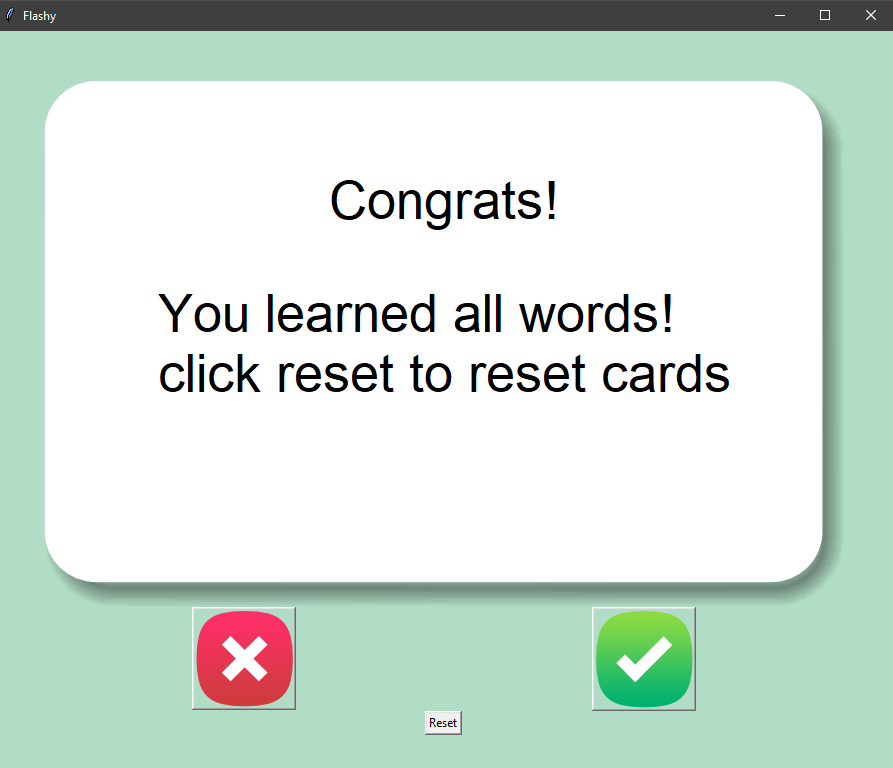

## Flash Card App

A language learning flashcard application with spaced repetition.

**Features:**

- French to English vocabulary practice
- Progress tracking and persistence
- Auto-flip cards after 5 seconds
- Reset functionality

**Known Improvements:**

- Could add more robust error handling for dictionary removal
- Would benefit from better state management
- Could add multiple language support
- User create his own version of flashcards

**Skills Demonstrated:** Tkinter GUI, pandas data manipulation, file handling

## 🖼️ Application Screenshots

### 🃏 Flash Card – Front Side

Displays the French word before the card flips.

---

### 🔄 Flash Card – Back Side

Automatically flips to show the English translation.

---

### 🎉 Learning Completed

Displayed when all words have been learned successfully.

