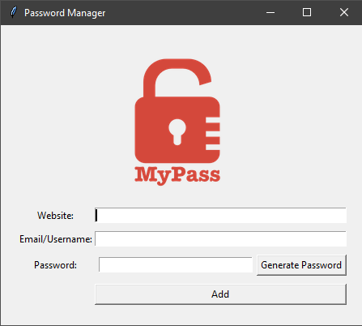
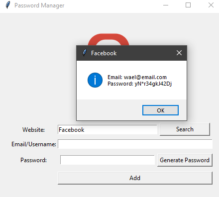
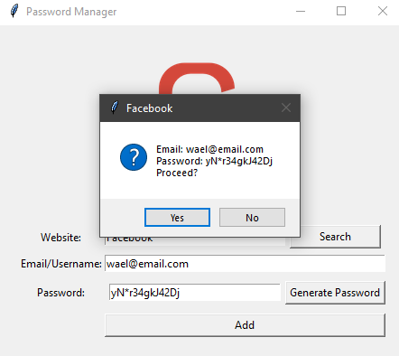
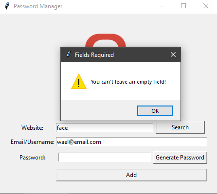

# Password Manger

## About the Project

A simple desktop password manager built with Python and Tkinter.
It allows you to securely store website credentials (Website, Email/Username, Password) locally in a JSON file.
The app can also generate strong random passwords and retrieve saved credentials quickly.

## ✨ Features

- 🔐 Save website credentials securely to data.json

- 🔎 Search saved credentials by website name

- ⚠️ Validation to prevent empty submissions

- 📁 Automatic JSON handling

  - Creates file if missing
  - Handles corrupted / empty JSON file safely

- 🔑 Built-in password generator (letters + digits + symbols)

## 🖥️ Technologies Used

- Python 3

- Tkinter to build the GUI

- JSON (local storage) to as structure to save credentials

- A user-defined Password Generator

## 🖼️ Screenshots

### 📌 User Interface

A clean and simple password manager UI built with Tkinter.

---

### 🔍 Search Feature

Search any saved website to instantly retrieve its stored email and password.

---

### ✅ Save Confirmation

The app confirms before saving credentials to avoid mistakes.

---

### ⚠️ Validation Warning

If required fields are empty, the app prevents saving and shows a warning.

