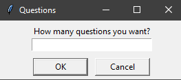
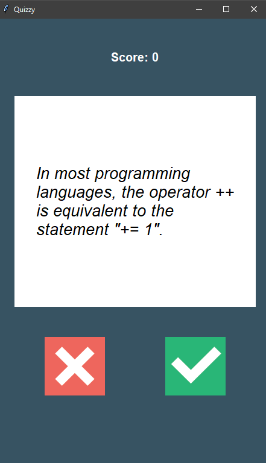
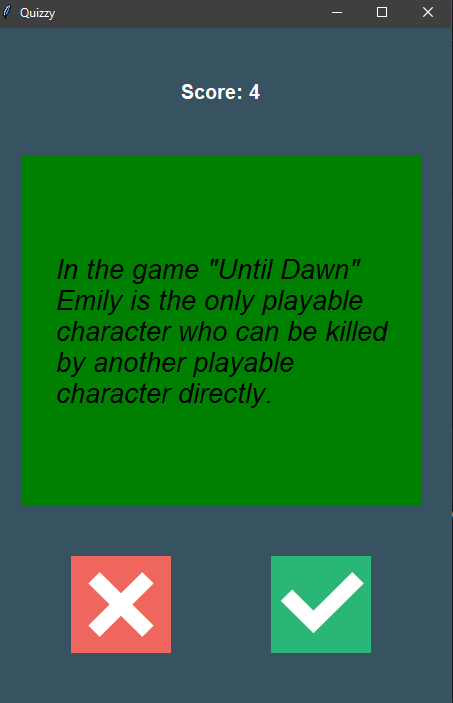
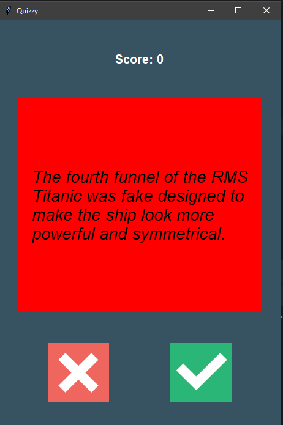
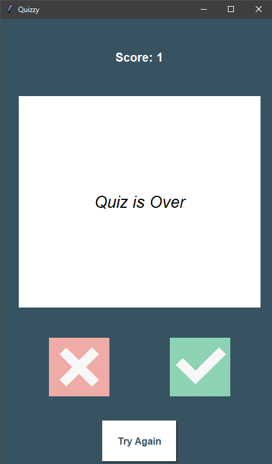

# Quizzy - Interactive Quiz Application

A modern, GUI-based quiz application built with Python and Tkinter that fetches trivia questions from the Open Trivia Database API.


## 📋 Features

- **Dynamic Question Loading**: Fetches True/False questions from the Open Trivia Database API
- **Customizable Quiz Length**: Users can choose how many questions they want to answer
- **Real-time Score Tracking**: Live score updates as you progress through the quiz
- **Visual Feedback**: Color-coded responses (green for correct, red for incorrect)
- **Clean UI**: Modern, centered interface with intuitive button controls
- **Try Again Feature**: Restart the quiz with new questions at any time
- **HTML Entity Decoding**: Properly displays special characters in questions

## 🚀 Demo

The application features:

- A centered, full-height window for optimal visibility
- Smooth transitions between questions
- Instant visual feedback on answer selection
- Final score display with option to retry

## 🛠️ Technologies Used

- **Python 3.8+**
- **Tkinter** - GUI framework
- **Requests** - API communication
- **HTML** - Decoding special characters
- **Open Trivia Database API** - Question source

## 🎮 Usage

1. Run the application:

```bash
python main.py
```

2. Enter the number of questions you want when prompted

3. Answer True or False by clicking the corresponding button

4. View your score in real-time at the top of the window

5. After completing the quiz, click "Try Again" to start a new quiz

## 📁 Project Structure

```
quizzy/
│
├── main.py              # Application entry point
├── UI.py                # GUI interface class
├── quizbrain.py         # Quiz logic and game management
├── question.py          # Question model class
├── data.py              # API communication and data fetching
├── images/              # Button icons
│   ├── true.png
│   └── false.png
└── README.md
```

## 🔧 Code Architecture

### Object-Oriented Design

The application follows OOP principles with clear separation of concerns:

- **QuizInterface**: Manages the GUI and user interactions
- **QuizBrain**: Handles quiz logic, scoring, and question management
- **Question**: Represents individual quiz questions
- **Data Module**: Handles API requests and data processing

### Key Components

**QuizInterface (UI.py)**

```python
class QuizInterface:
    - Manages Tkinter window and widgets
    - Handles user input (True/False buttons)
    - Displays questions and provides visual feedback
    - Centers window on screen for optimal UX
```

**QuizBrain (quizbrain.py)**

```python
class QuizBrain:
    - Tracks current question and score
    - Validates answers
    - Manages quiz progression
    - Determines when quiz is complete
```

**Question (question.py)**

```python
class Question:
    - Stores question text
    - Stores correct answer
```

## 🌐 API Integration

The app uses the [Open Trivia Database API](https://opentdb.com/):

- Endpoint: `https://opentdb.com/api.php`
- Question Type: Boolean (True/False)
- Dynamic question count based on user input

## 🎨 UI Features

- Startup

  

- Questions
  

- **Visual Feedback**:

  - Green background for correct answers
    

  - Red background for incorrect answers
    

- End of the Quiz
  

## 🔄 How It Works

1. User launches the application
2. Dialog prompts for desired number of questions
3. API fetches questions based on user input
4. Questions are displayed one at a time
5. User clicks True or False
6. Immediate visual feedback (color change)
7. Score updates automatically
8. After all questions, final score is displayed
9. "Try Again" button allows starting a new quiz

## 🐛 Error Handling

- API request validation with `raise_for_status()`
- HTML entity decoding for special characters
- Proper state management for buttons (disabled after quiz completion)
- Clean window initialization to prevent UI glitches

## 👏 Acknowledgments

- [Open Trivia Database](https://opentdb.com/) for providing the free API
- Angela Yu's 100 Days of Code bootcamp for project inspiration
- Tkinter documentation and community
